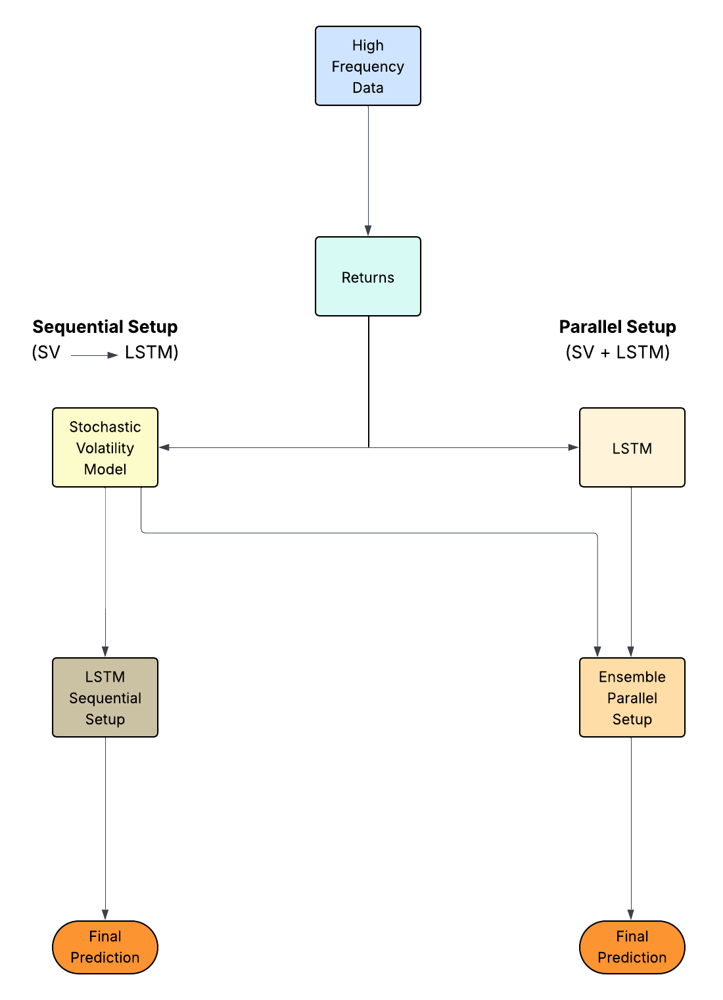

# Stochastically-Driven Hybrid Artificial Intelligence Models for High-Frequency Crash Risk Prediction in Financial Markets

TThis repository presents a stochastic-driven hybrid modeling framework for crash risk prediction in financial markets. The research develops and analyzes three stochastic volatility models driven by Lévy processes: the Gamma–Ornstein–Uhlenbeck, Poisson–Ornstein–Uhlenbeck, and Jump-Diffusion Ornstein–Uhlenbeck processes.

To enhance the detection of complex temporal dynamics in high-frequency financial data, these stochastic models are integrated with an artificial intelligence (AI) component, specifically Long Short-Term Memory (LSTM) neural networks. Two hybrid integration strategies are investigated. In the sequential configuration, the LSTM is trained on volatility series simulated from the stochastic models. In the parallel configuration, the LSTM is trained independently on observed high-frequency financial data, and its forecasts are combined with those of the stochastic models using equal weighting.

This hybrid framework combines the theoretical rigor of stochastic volatility modeling with the adaptive learning capability of deep neural networks, aiming to improve the accuracy of crash risk prediction. Empirical results demonstrate that the parallel configuration consistently outperforms the sequential approach, as measured by the Root Mean Square Error (RMSE), highlighting its strong potential for practical applications in high-frequency financial forecasting.

---

## Motivation

The prediction of crash risks in financial markets holds profound
significance for financial stability, risk management, and economic policymaking. Improving our
understanding and knowledge of market dynamics, and enhancing our ability to predict such events
is crucial for safeguarding both institutional and retail investors, as well as for maintaining the
resilience of the broader financial system.

Conventional frameworks, though have the mathematical grounding, often lack the flexibility to adapt to real-time
data patterns. On the other hand, many modern deep learning approaches, despite their strong
predictive strength, struggle with interpretability and alignment with financial theory, limiting
their utility in risk-sensitive applications.

This repository aims to bridge theory-driven and data-driven models by integrating:
- Lévy-driven stochastic volatility models, with  
- Artificial Intelligence component.

---

## Hybrid Learning Architectures

- Sequential Configuration  
- Parallel Configuration  

---

### Sequential Configuration
The approach integrates an LSTM neural network with simulated volatility series generated by the stochastic models.

The final forecast is given as:

$$
V_{\text{final}}(t) = F_{\text{LSTM}}\bigl(V_{\text{stochastic}}(t)\bigr)
$$

---

### Parallel Configuration
In the parallel setup, the LSTM neural network is trained independently on observed high-frequency financial data, and its forecasts are combined with those of the stochastic volatility models using equal weighting to improve crash risk prediction.

The final forecast is obtained by combining both outputs through a weighted average:

$$
V_{\text{final}}(t) = w*V_{\text{stochastic}}(t) + (1 - w)*V_{\text{LSTM}}(t)
$$

---
## Flowchart illustrating the integration of high frequency data into a Hybrid volatility prediction model (Parallel and Sequential).

  

---

## Data Description

This repository uses high-frequency financial data from the Standard & Poor’s 500 (S&P 500) index, a widely recognized benchmark of the U.S. equity market. The dataset consists of minute-level price observations collected between April 3, 2017 (13:30 UTC) and August 31, 2017 (20:00 UTC), capturing both stable and volatile market regimes.

Each data record includes a timestamp and the corresponding index price. Minute-by-minute S&P 500 data is particularly well-suited for this study, as it enables the analysis of microstructural dynamics and short-term volatility fluctuations, which are essential for high-frequency crash risk prediction.

